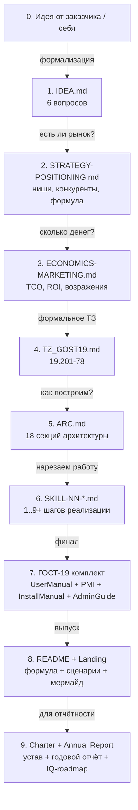

# Жизненный цикл проекта — 9 стадий документации

Этот плейбук — **карта** документов, которые Олег создаёт на каждом этапе.
Извлечено из реальных папок `~/<PROJECT>/docs/` (RAGRAF, LEYKA, AI-SKLAD,
POLINOM, GONKA, NSK_OpenData_Bot).

> **Главный принцип:** документ не сочиняется — он формализует то, что
> происходит на стадии. Каждый документ закрывает свою стадию и больше
> не правится (становится «историческим»). Актуальные требования
> переезжают в следующий документ.

---

## Девять стадий и какой документ их закрывает

| # | Стадия | Документ-закрывает-стадию | Плейбук | Эталон |
|---|--------|---------------------------|---------|--------|
| 0 | Идея от заказчика | — | — | устное ТЗ |
| 1 | Формализация идеи | `IDEA.md` | [01-idea-formalization](01-idea-formalization.md) | [AI-SKLAD/IDEA.md](../../projects/active/ai-sklad/README.md) |
| 2 | Поиск ниши и позиционирование | `STRATEGY-POSITIONING.md` | [02-niche-positioning](02-niche-positioning.md) | RAGRAF/docs/STRATEGY-POSITIONING.md |
| 3 | ТЭО (НИР-аналог): экономика + маркетинг | `ECONOMICS-MARKETING.md` | [03-nir-economics](03-nir-economics.md) | RAGRAF/docs/ragraf_economics_marketing_report.md |
| 4 | Техническое задание (ГОСТ 19.201-78) | `TZ_<PROJECT>_GOST19.md` | [04-tz-and-gost-19](04-tz-and-gost-19.md) | RAGRAF/docs/TZ_RAGRAF.md, LEYKA/docs/LEYKA_TZ_GOST19.md |
| 5 | Архитектура | `ARC.md` (18 секций) | [05-architecture](05-architecture.md) | RAGRAF/docs/ARC.md, LEYKA/docs/ARC.md |
| 6 | Нарезка реализации | `SKILL-01-idea.md … SKILL-NN-<feature>.md` | [06-skill-series](06-skill-series.md) | GONKA/SKILL-01-idea.md … SKILL-09-demo-mode.md |
| 7 | ГОСТ-19 комплект (приёмка) | `<PROJECT>_UserManual_GOST19.md`, `_InstallManual_`, `_AdminGuide_`, `_PMI_` | [07-gost-19-doc-set](07-gost-19-doc-set.md) | LEYKA/docs/LEYKA_*_GOST19.md (5 файлов) |
| 8 | README + лендинг (для рынка) | `README.md`, `README-en.md` | [08-readme-landing](08-readme-landing.md) | RAGRAF/README.md, POLINOM/README.md + README-en.md |
| 9 | Отчётность и рост | `Charter`, `Annual Report`, `IQ-roadmap.md`, `BACKLOG.md` | [09-charter-reports-growth](09-charter-reports-growth.md) | LEYKA/docs/SKILL-PROJECT-CHARTER-AND-REPORTS.md, NSK/IQ-roadmap.md |

---

## Принципы, которые действуют на всех стадиях

### 1. Один документ закрывает одну стадию

После того как стадия пройдена, документ **не редактируется**. Он
становится историческим артефактом («Что мы думали тогда»). Все
актуальные требования переезжают в следующий документ.

Пример: `AI-SKLAD/IDEA.md` начинается с шапки:
> «Жанр: исходный документ. Закрывает фазу 0. Не обновляется после
> фазы 1. Актуальные требования — в SKILL-inventory-ai-demo.md.»

### 2. Не дублируй — ссылайся

> «Та же информация в двух документах = расхождение через месяц».
> *(RAGRAF/docs/SKILL-GOST-19.md §5)*

Каждому типу контента — один канонический источник:

| Тип контента | Канонический источник |
|--------------|----------------------|
| Требования | TZ (ГОСТ 19.201) |
| Архитектурные решения, ADR | ARC.md |
| Что делает фича для пользователя | README §11-15 |
| Конкретные шаги UI | UserManual_GOST19 |
| Список эндпоинтов | ARC.md §11 |
| Установка | README + installer/INSTALL-*.md |

### 3. Каждой стадии — своя метрика «готово»

Не «дописал документ» — а конкретный сигнал перехода:

| Стадия | Сигнал «готово» |
|--------|-----------------|
| 1. IDEA | Антископ зафиксирован, метрика проверки задана |
| 2. POSITIONING | 3 ниши выбраны, 3 ниши отвергнуты явно |
| 3. ECONOMICS | TCO + ROI посчитаны для 3+ сегментов |
| 4. ТЗ | Прошло формальное согласование (если есть заказчик) |
| 5. ARC | Архитектура помещается на одну страницу + 18 разделов на детали |
| 6. SKILL-NN | Каждый skill доводит до работающей фичи |
| 7. ГОСТ-19 комплект | Все 4-5 документов написаны и кросс-связаны |
| 8. README | Видео-демо / GIF + чёткое value-prop + onboarding < 5 мин |
| 9. Charter | Подписан / KPI quarterly считаются автоматом |

### 4. Антископ важнее, чем скоуп

> «Жёсткий список того, что в demo и v1.0 **не реализуем** — чтобы не
> расползаться».
> *(AI-SKLAD/IDEA.md §5, 10 пунктов антископа)*

На стадии 1 и 2 всегда явно фиксируй, **чего НЕ делаешь**. Это спасает
от 80% будущих переделок.

### 5. Теоретическая рамка > свободная стилистика

Большие проекты Олега опираются на **внешнюю формальную методологию**:

- **POLINOM / POLINOM-JAVA** — Сигма-методология полиномиальной
  сложности (Гончаров/Нечесов/Свириденко).
- **RAGRAF** — задачный подход (Гончаров/Свириденко) + теория
  функциональных систем (Анохин).
- **LEYKA** — устав/отчёт КОСГУ + Redmine-style RBAC.
- **NSK_OpenData_Bot** — IQ-индекс городов Минстроя.

См. [knowledge/patterns/audit-vs-framework.md](../../knowledge/patterns/) —
паттерн «аудит продукта относительно теоретической рамки».

---

## Что сделать на старте каждого нового проекта

1. **Создай `projects/active/<slug>/`** — копия `_template/`.
2. **Сразу обозначь стадию** — `status: idea | positioning | tz | arch | impl | release`.
3. **Прочитай [knowledge/lessons/](../../knowledge/lessons/)** — что важно не повторять.
4. **Открой соответствующий плейбук этой стадии** — действуй по нему.
5. **Не прыгай через стадии без причины.** Если стадия пропущена сознательно — запиши почему в `decisions.md` проекта.

---

## Связанное

- [knowledge/skills/](../../knowledge/skills/) — рецепты, рождённые из этих стадий
- [docs/decisions/](../decisions/) — ADR-решения, общие для всех проектов
- [concepts/](../../concepts/) — определения ключевых терминов (задачный подход, ТЗ, ГОСТ-19, КОСГУ)
