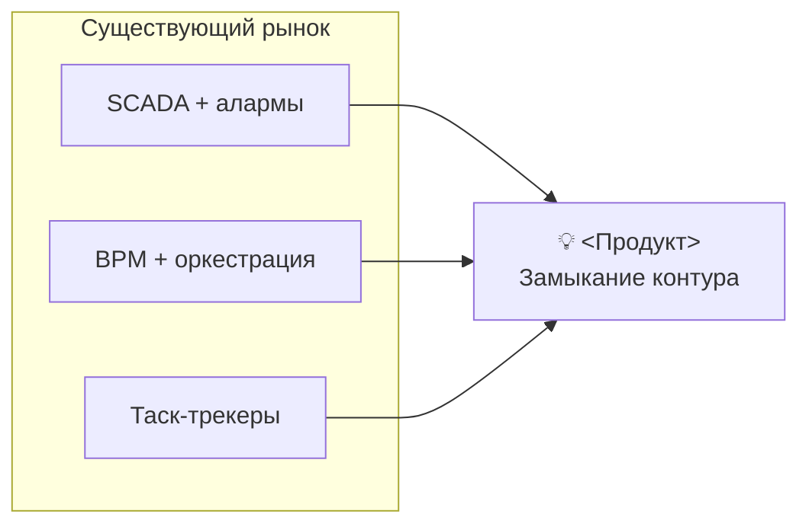
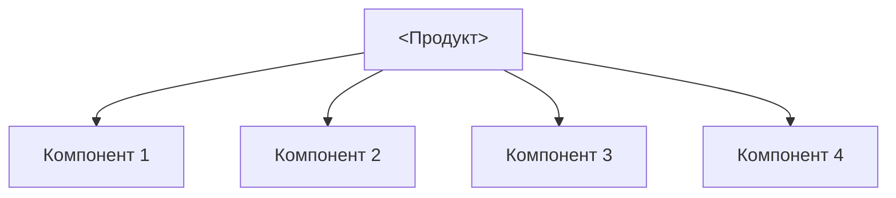

# Стадия 8 — README + лендинг

**Вход:** реализован MVP, продукт работает.
**Выход:** `README.md` в корне репо (рус) + `README-en.md` (англ).
**Время:** 1-2 дня. Обновляется регулярно.
**Эталоны:**
- `~/RAGRAF/README.md` — Mermaid + формула + ссылки на студию/демо
- `~/POLINOM/README.md` + `README-en.md` — бейджи CI + commercial value section
- `~/AI-SKLAD/README.md` — локальный запуск + Vercel-деплой

> README.md — **главный публичный артефакт проекта**. Это и лендинг для
> клиента, и onboarding для разработчика, и питч для инвестора.

---

## Структура README (на основе RAGRAF/POLINOM/AI-SKLAD)

### 1. Заголовок + слоган (3 строки)

```markdown
# <НАЗВАНИЕ>

> **<Одна сильная фраза-обещание.>**
>
> <2 строки разворота: что система делает, для кого, с каким эффектом.>
```

Пример (RAGRAF):
> «Задачи перестают теряться между датчиком и человеком.
> Платформа замыкает контур: датчик замечает событие, регламент решает
> что делать, исполнитель получает поручение в мессенджере — и факт
> возвращается обратно в систему».

### 2. Быстрые ссылки на демо/студию/доки

```markdown
[**🎯 Лендинг**](https://x.up.railway.app) ·
[**📐 Студия**](https://x.up.railway.app/studio) ·
[**🧠 Методология**](https://x.up.railway.app/methodology) ·
[**📊 Live**](https://x.up.railway.app/live)
```

Иконки-эмодзи допустимы только здесь и в заголовках разделов лендинга
README. **В коде и других md-файлах — нет.**

### 3. Бейджи (если есть CI / релизы)

```markdown
[](...)
[](...)
[](...)
```

Полезные бейджи: CI (тесты), language version, demo link, latest results.

### 4. «Зачем X» — value proposition с Mermaid-схемой

Это **главная секция лендинга**. Структура:

```markdown
## Зачем <X>

На рынке отсутствует целостный инструмент, который одновременно делает
A, B и C. Существующие системы закрывают части картинки:



→ Подробное ТЭО: [docs/TZ.md §2](docs/TZ.md#2-теэо)
```

### 5. «Главная идея» — формула + теоретическая рамка

```markdown
## Главная идея — <Название>

<Продукт> — практическая реализация **<методология>** <автор-источник>.



→ Теория «на пальцах»: [docs/GLOSSARY.md](docs/GLOSSARY.md)
→ Whitepaper: [/methodology](url)
```

### 6. Главные сценарии / Mermaid data-flow

Один-два сценария end-to-end. Mermaid `flowchart TD` с лейблами edges.

### 7. Запуск локально (для разработчиков)

```markdown
## Локальный запуск

**macOS:** двойной клик на `start.command` …
**Windows:** двойной клик на `start.bat` …
**Linux:**
```bash
python3 -m unittest …
python3 server.py
```

**Требования:** Python 3.10+, без внешних зависимостей.
```

### 8. Деплой (если есть демо в облаке)

Опишите два варианта: CLI и web-интерфейс. Дайте `vercel.json` /
`railway.json` / `Dockerfile` inline.

### 9. Структура проекта

`tree`-листинг 15-20 строк. Без всех файлов — только ключевые папки и
файлы с пометками-комментариями.

### 10. Документация (ссылки)

```markdown
## Документация

- [docs/TZ.md](docs/TZ.md) — техническое задание (ГОСТ 19.201)
- [docs/ARC.md](docs/ARC.md) — архитектура (18 секций)
- [docs/X_UserManual_GOST19.md](docs/X_UserManual_GOST19.md) — руководство пользователя
- [docs/STRATEGY-POSITIONING.md](docs/STRATEGY-POSITIONING.md) — стратегия
- [docs/BACKLOG.md](docs/BACKLOG.md) — roadmap
```

### 11. Коммерческая ценность (если продукт коммерческий)

Один-два абзаца + ссылка на ECONOMICS-MARKETING. Не сильно расширяй —
большой документ полностью в `docs/`.

### 12. Лицензия и контакты

---

## README-en.md (билингвальная пара)

POLINOM имеет и русский, и английский README. Отличия:

| Аспект | README.md (рус) | README-en.md (англ) |
|--------|----------------|---------------------|
| Аудитория | российский рынок, госзаказчик, гранты | open-source комьюнити, международные коллеги |
| Длина | полная | сжатая (50-70% русской) |
| ГОСТ-ссылки | есть | как пометка, не главное |
| Эмодзи | умеренно | умеренно |
| Бейджи | те же | те же |
| Стиль | формально-нейтральный | технический, дружелюбный |

Кросс-ссылку **обязательно сверху**:
```markdown
> English version: [`README-en.md`](README-en.md).
> Russian version: [`README.md`](README.md).
```

---

## Формула позиционирования для слогана

> **«<Продукт> — <реализация чего> в виде <формы> для <применения>».**

Примеры:
- **POLINOM** — научно и эмпирически обоснованный инструмент контроля
  сложности Python-кода с одной командой.
- **RAGRAF** — практическая реализация задачного подхода Гончарова-Свириденко
  в виде открытой операционной платформы для управления процессами
  IoT + люди.
- **AI-SKLAD** — демо-прототип «ИИ-Аналитик остатков готовой продукции»
  — классификация SKU + рекомендации «товар → действие → срок → эффект».

---

## Antipatterns README

❌ **Длинная лирика про вдохновение** — никто не читает.

❌ **Скриншоты без подписи** — пользователь не понимает контекст.

❌ **Battery-included обещания без оговорок** — теряется доверие.

❌ **Tutorial внутри README** — выноси в `docs/playbooks/`.

❌ **Roadmap в середине README** — отвлекает. Если есть — в конец, и
   только high-level.

---

## Связанное

- Предыдущая: [07-gost-19-doc-set](07-gost-19-doc-set.md)
- Следующая: [09-charter-reports-growth](09-charter-reports-growth.md)
- Концепт: [concepts/positioning-formula.md](../../concepts/)
- Эталоны: `~/RAGRAF/README.md`, `~/POLINOM/README.md`+`README-en.md`, `~/AI-SKLAD/README.md`, `~/GONKA/README.md`
