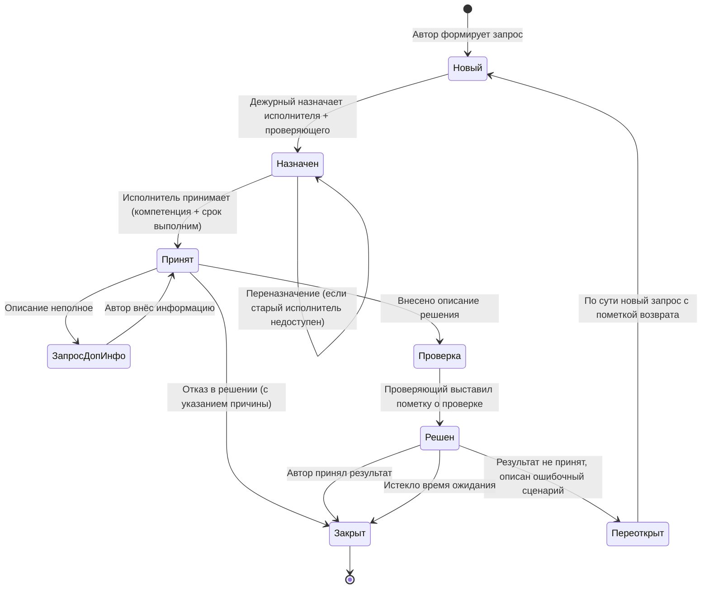

# Стадия 10 (постфаза) — Эксплуатация и техническая поддержка

**Вход:** продукт в коммерческой эксплуатации (после стадии 8 release
+ начало стадии 9 growth).
**Выход:** действующий регламент работы отдела ТП + работающая система
регистрации заявок + SLA в договоре с заказчиком.
**Время:** регламент пишется за 1-2 недели, потом живёт и
актуализируется.

> Это **постфаза** жизненного цикла. У многих проектов её нет, потому
> что продукт остаётся на стадии «делаем, никто не пользуется». Когда
> появляется **первый платящий заказчик** — ТП обязательна, и нужен
> формальный регламент.

---

## Цель и область регламента ТП

Регламент специфицирует **политику работы отдела технической поддержки**:
- кто (роли),
- что обрабатывает (типы запросов, источники),
- по каким срокам (SLA),
- через какие состояния (статусы запроса),
- с какими критериями качества.

Документ предназначен для сотрудников ТП и коллег из других отделов,
взаимодействующих с ТП.

---

## Базовые определения

| Термин | Значение |
|--------|----------|
| **ТП, ОТП** | Техническая поддержка, отдел технической поддержки |
| **Продукт** | ПО + АО (программное и аппаратное обеспечение), за работу которого отвечает компания |
| **Запрос** | Обращение с проблемой в отдел ТП |
| **Заказчик** | Организация-эксплуатант продукта (или представитель) |
| **Время реагирования** | Максимальный срок с момента запроса до подтверждения получения и начала обработки |
| **Временное решение (workaround)** | Решение, обеспечивающее работу без признаков проблемы, но не гарантирующее устранения причины. Возможны ограничения, **не влияющие на услуги клиентов / тарификацию / управление / мониторинг** |
| **Простой** | Запланированное/незапланированное ограничение предоставления услуг |
| **Решение проблемы** | Окончательное устранение причины, исключает повтор |
| **Система мониторинга** | ПАК с уведомлениями (e-mail, Telegram) |
| **Service desk** | Программный комплекс обработки запросов |
| **Журнал нарушений** | Отчётность по работе ТП — сроки, количество, качество |

---

## Роли (5 шт.)

| Роль | Описание |
|------|----------|
| **Автор** | Представитель заказчика с доступом в service desk. Запрос может зарегистрировать дежурный по обращению, но **Автором остаётся представитель заказчика** (или сотрудник компании для внутренних запросов) |
| **Дежурный** | Сотрудник ОТП на круглосуточном мониторинге |
| **Исполнитель** | Сотрудник компании. Может быть дежурным, инженером ОТП или сотрудником другого отдела |
| **Руководитель ТП** | — |
| **Проверяющий** | Сотрудник с компетенцией в данном вопросе, проверяет выполненные работы |

---

## Типы запросов (5 шт.)

| Тип | Описание |
|-----|----------|
| **Проблема** | Сбой в ПО/АО |
| **Задача** | Запрос на работу, не связанный со сбоем: установка нового ПО, изменение настроек |
| **Вопрос** | Запрос консультации |
| **Доработка** | Запрос на изменение ПО, который не решается настройками |
| **Претензия** | От сервисного отдела партнёра, в т.ч. жалобы абонентов |

---

## Уровни важности (приоритеты, 4 шт.)

Уровень важности определяется **совместно** заказчиком и контактным
лицом ТП (или руководителем ТП).

| Уровень | Критерии |
|---------|----------|
| **Критический** | Серьёзное ограничение или отсутствие услуги · Потеря управления/мониторинга · Сбой тарификации · **Потеря данных или угроза** · **Утечка данных или угроза** |
| **Высокий** | Потеря системной эффективности · Сбои, требующие доп. ресурсов · Невозможность переконфигурации · Выход из строя резервного устройства |
| **Средний** | Неработоспособность отдельных функций, не влияющих на качество услуг / контроль / управление / трафик · Сбой статистики |
| **Низкий** | Функционально-технические запросы, рекомендации, процедуры техобслуживания, настройка |

---

## SLA (Service Level Agreement)

См. [concepts/sla](../../concepts/sla.md) — подробное описание.

| Уровень | Время реагирования | Временное решение | Окончательное решение |
|---------|--------------------|--------------------|------------------------|
| **Критический** | 15 мин | 4 часа | 20 кален. дней |
| **Высокий** | 2 часа | 2 кал. дня | 20 кал. дней |
| **Средний** | 1 рабочий день | 10 кал. дней | 20 кал. дней |
| **Низкий (общий вопрос)** | 1 рабочий день | не нормируется | 10 кал. дней |

---

## Предварительные условия приёма запроса

Если **любое** не выполнено — запрос **не принимается**:

1. **Наличие действующего договора на ТП** (подписан, не просрочен,
   не прекращён за неоплату). Список актуальных договоров ведёт
   руководитель ТП.
   _Исключение:_ внутренние заказчики (отделы компании) и клиенты
   бесплатных сервисов.
2. **Уровни доступа** — пользователь имеет права в service desk на
   данный проект. Права выдаёт ОТП при регистрации проекта или смене
   контактов.

---

## Статусы запроса (8 шт.) и переходы

| Статус | Описание |
|--------|----------|
| **Новый** | Заведён, уникальный номер присвоен, исполнитель не назначен |
| **Назначен** | Исполнитель назначен |
| **Принят** | Исполнитель приступил, проставлен ожидаемый срок |
| **Запрос доп. информации** | Не хватает информации для выполнения |
| **Решен** | Работы завершены, результаты на проверку |
| **Проверка** | Проверяющий проверяет перед передачей заказчику |
| **Закрыт** | Работы приняты заказчиком (или истёк срок ожидания) |
| **Переоткрыт** | Возникли вопросы по выполнению, возврат на доработку |

---

## Управление запросами — автоматизация в service desk

Система должна автоматически:

1. **При поступлении нового запроса** — уведомление на группу дежурных
   (по e-mail / Telegram).
2. **Если не назначен в срок по SLA** — повторное уведомление + сигнал руководителю ТП.
3. **Подтверждение назначения** — исполнитель указывает дату выполнения.
   **Критические запросы дублируются по телефону.**
4. **Ежедневная сводка** исполнителю — список задач + просроченные.
5. **Уведомления о скором истечении срока** — за 1-2 дня.
6. **Для статуса «Запрос доп. информации»** — уведомление Автору,
   повторное при отсутствии, уведомление Исполнителю при получении.
7. **Для «Проверка»** — уведомление проверяющему, контроль сроков.
8. **Для «Решен»** — уведомление Автору; **через 7 дней без действия
   автоматически переходит в «Закрыт».**

---

## Показатели качественной обработки запроса

| Показатель | Срок | Ответственный |
|------------|------|---------------|
| Запрос зарегистрирован, присвоен ID | 15 мин (или по SLA) | Дежурный |
| Запрос назначен на исполнителя | 30 мин после регистрации | Дежурный |
| Запрос принят исполнителем | 1 рабочий день | Исполнитель |
| Тип/приоритет проставлены, дата окончания назначена | 1 рабочий день | Исполнитель |
| Результат проверен | 1 рабочий день после завершения работ | Руководитель ТП / Проверяющий |

При срабатывании показателя система пишет запись в журнал нарушений.

---

## Критерии качественного решения

**Любого** одного из:
- Автор подтвердил правильность выполнения.
- Проблема перестала диагностироваться системой мониторинга.
- Проблема больше не повторяется.
- Соблюдены формальные требования по чек-листу проверки работ.

**Результат должен содержать:**
- Правильное указание причины (root cause).
- Обоснованный ответ с аргументацией (логи / доп. инфа).
- Если проблема не на нашей стороне → предложить Автору варианты.
- Соответствие SLA (внутреннему или из договора).

**Анализ качества** — руководитель ТП **не реже раза в месяц**.
Критические запросы — анализ **сразу после решения**.

---

## Источники запросов

### Внешние

- Договорные заказчики ТП. Каждый договор имеет список контактов и
  может иметь свой SLA.

### Внутренние

- Запросы от сотрудников компании.
- **Автоматическая система мониторинга** — уведомления **критического
  и высокого** уровня важности **обязательно регистрируются** в
  service desk.

---

## База знаний по предотвращению и решению проблем

> В исходном регламенте раздел заявлен, но не заполнен. Это типовой
> пропуск.
>
> **Хорошая практика:** после каждого `Закрыт` запроса с типом
> «Проблема» — обязательная запись в базу знаний:
> - симптом (как искать в будущем),
> - root cause,
> - решение (шаги),
> - предотвращение (что добавить в мониторинг / тесты).
>
> **Связь с моим vault'ом:** это **прямой источник для
> `knowledge/lessons/`** в моих собственных проектах. Каждое решение
> commercial-support ticket = кандидат в lesson при условии
> применимости вне проекта.

---

## Когда применять в моих проектах

| Категория проекта | Регламент ТП нужен? |
|-------------------|---------------------|
| **A — заказной коммерческий** | ✅ Обязательно. Регламент + договор + SLA + service desk |
| **B — pet** | ❌ Нет |
| **C — научно-инструментальный** | ⚠ При наличии индустриального партнёра — облегчённый регламент (только Низкий/Средний приоритеты) |
| **D — демо** | ❌ В демо нет. При переходе пилота в production — добавить |

| Конкретно проекты | Применимость |
|-------------------|--------------|
| LEYKA в production у ЦИИ НГУ | Внутренний регламент со Средним/Низким приоритетом |
| RAGRAF с коммерческим пилотом | Полный регламент со всеми 4 уровнями |
| demo-sigma в ЕДДС | Жёсткий регламент — ЕДДС критическая инфраструктура |
| AI-SKLAD / STROY (демо) | Не нужен до перехода в пилот |

---

## Антипаттерны (что часто ломается)

❌ **Регламент без service desk-инструмента.** Регламент = бумага.
   Нужен реальный инструмент (Jira Service Desk, Zendesk, OTRS,
   собственный) с автоматикой.

❌ **SLA одинаковый для всех клиентов.** Должен зависеть от тира
   договора (см. [sla](../../concepts/sla.md)).

❌ **Все запросы = «Критический».** Заказчик быстро учится ставить
   максимальный приоритет на всё → SLA рушится. Нужны явные критерии
   уровней + ответственное согласование.

❌ **Нет журнала нарушений.** Без него нельзя улучшать процесс.

❌ **База знаний — пустой раздел регламента.** Без неё каждая
   проблема решается с нуля.

❌ **Регламент без раздела `Правила пересмотра`.** Регламент должен
   обновляться раз в 6-12 месяцев + после каждого крупного инцидента.

---

## Какие документы создать рядом с регламентом

Полный комплект для коммерческой эксплуатации:

| Документ | Назначение |
|----------|-----------|
| `support-policy.md` (этот плейбук адаптированный) | Сам регламент работы ТП |
| `sla-<client>.md` или приложение к договору | SLA для конкретного клиента / тира |
| `incident-templates.md` | Шаблоны post-mortem критических инцидентов |
| `runbook-<service>.md` | Runbook'и по сценариям аварий для каждого сервиса |
| `oncall-schedule.md` | График дежурств |
| `knowledge-base/` | База решений (живая, заполняется после каждого ticket'а) |

---

## Связь с другими стадиями ЖЦ

- **Стадия 7 (ГОСТ-19 doc set)** — `<PROJECT>_AdminGuide_GOST19.md`
  включает раздел про эксплуатацию. Регламент ТП — его развитие для
  коммерческого продукта.
- **Стадия 9 (Charter / report)** — ежеквартальный отчёт ТП по SLA
  входит в Годовой отчёт.
- **Источник lessons:** каждое решение critical/high ticket'а —
  кандидат в [knowledge/lessons/](../../knowledge/lessons/).

---

## Связанное

- Концепт: [sla](../../concepts/sla.md) — детально про SLA
- Концепт: [product-focus](../../concepts/product-focus.md) — фокус «Интеграция» (процессы компании, IT)
- ADR-002: [adr-002-doc-set-per-project](../decisions/adr-002-doc-set-per-project.md) — категории проектов
- Предыдущая стадия: [09-charter-reports-growth](09-charter-reports-growth.md)
- Mapping методологии: [10-product-focus-mapping](10-product-focus-mapping.md)
