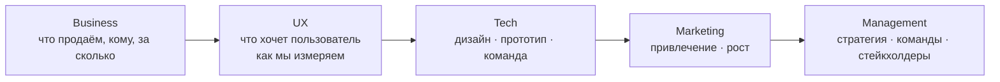

# Мета-плейбук: 5-буквенная канва + 11 спринтов

Это **второй мета-плейбук** vault'а (первый — [10-product-focus-mapping](10-product-focus-mapping.md)).
Здесь — более **детальная** последовательность работы с продуктом, синтезированная
из современной PM-практики. Она не заменяет твои [9 стадий ЖЦ](00-product-lifecycle.md) —
она их **гранулирует**.

> **Главная ценность этого плейбука — последовательность шагов.** Терминология
> (AARRR, ARPU, VPC, JTBD, MoSCoW, RICE, PLG, Bartle, Moore) — это словарь.
> Сама последовательность — это маршрут.

---

## Часть I — Макро-канва: 5 букв

Современный продуктовый менеджмент стоит на пересечении пяти дисциплин:

| Буква | Что отвечает | Главные инструменты |
|-------|--------------|---------------------|
| **B — Business** | Чем зарабатываем? | TAM/SAM/SOM, юнит-экономика, Lean Canvas, бизнес-модели, тренды, Moore |
| **U — UX** | Как понимаем пользователя? | JTBD, CustDev, глубинные интервью, опросы, юзабилити, продуктовая аналитика, A/B |
| **T — Tech** | Как строим? | SWOT, POV, прототипы lo/mid/hi-fi, MVP, RAT, Scrum, бэклог, приоритизация |
| **M — Marketing** | Как продаём и растим? | AARRR-воронка, позиционирование, УТП, оффер, PLG, growth hacking |
| **M — Management** | Как управляем системой? | Стейкхолдеры, портфель продуктов, оргструктура, дорожная карта, OKR, McKinsey 7S |

> **Полезное замечание:** канва не строго последовательна. На раннем
> прототипе ты прыгаешь между B и U десятки раз. Но **макро-направление**
> именно такое — от понимания рынка к управлению системой.

---

## Часть II — 11 спринтов: микро-последовательность

### Глава Business

#### Спринт 1 — Исследование рынка
- Оценка размера рынка (объём денег за год)
- TAM / SAM / SOM (см. [concepts/unit-economics](../../concepts/unit-economics.md))
- Анализ конкурентов
- Голубой океан vs конкуренция (Blue Ocean Strategy)
- Анализ аудитории и **сегментация** (см. [concepts/bartle-psychotypes](../../concepts/bartle-psychotypes.md))
- Средний чек рынка
- Тренды: технологические, социальные, экономические, культурные
- **Пропасть Мура** — между новаторами и массовым рынком (см. [concepts/moores-chasm](../../concepts/moores-chasm.md))

**Закрывает мою стадию:** [02-niche-positioning](02-niche-positioning.md) (плюс часть стадии 3).

#### Спринт 2 — Экономика и бизнес-модель
- Бизнес-модель (что отнимает работу у клиента и за счёт чего зарабатывает)
- **Lean Canvas** (см. [concepts/lean-canvas](../../concepts/lean-canvas.md)) — 9 блоков на одной странице
- Популярные бизнес-модели: B2B / B2C / B2B2C / freemium / subscription
- Популярные модели монетизации: продажа товаров / реклама / подписка / комиссия
- **Юнит-экономика** (см. [concepts/unit-economics](../../concepts/unit-economics.md)):
  выручка, расходы, сходимость, ARPU, ARPPU, CAC, LTV, каналы продаж

**Закрывает мою стадию:** [03-nir-economics](03-nir-economics.md).

---

### Глава UX

#### Спринт 3 — Продуктовые исследования
- Цели и гипотезы исследования
- 4 типа инструментов (восприятие × использование, качество × количество)
- Глубинные проблемные интервью
- Опросы (внутри приложения, по email, в соцсетях)
- Юзабилити-тестирование (= глубинное решенческое интервью)
- **JTBD vs CustDev** (см. [concepts/jtbd](../../concepts/jtbd.md)) — две конкурирующие модели понимания клиента
- **Mom Test** (см. [concepts/mom-test](../../concepts/mom-test.md)) — правила «Спросите маму» от Роба Фитцпатрика
- Описание аудитории и User Story
- **Value Proposition Canvas (VPC)** (см. [concepts/vpc](../../concepts/vpc.md)) — карта ценности + профиль потребителя

**Усиливает мой skill:** [discovery-interview](../../knowledge/skills/discovery-interview.md).
Спринт 3 — самый прямой источник новых техник для discovery.

#### Спринт 4 — Продуктовая аналитика
- Выбор ключевой метрики на основе модели монетизации
- Выбор ключевой метрики на основе стадии развития продукта
- Дерево метрик, юнит-экономика, retention
- Цикл жизни фичи
- Оценка эффекта фичи до запуска
- A/B-тестирование (и A/A/B для контроля качества)

**Расширяет мои инструменты — раздел, которого почти не было в vault'е до сих пор.**

#### Спринт 5 — Инструменты аналитики данных
- Google Analytics / Mixpanel / Amplitude — продуктовая аналитика
- Redash — визуализация и отчёты
- Apache Superset — дашборды
- ClickHouse — колоночная БД для аналитических запросов
- Spark, SQL, Python для обработки

**Технический раздел.** Если работаешь с данными — [knowledge/tools/](../../knowledge/tools/)
кандидат на отдельные tool-заметки.

---

### Глава Technology

#### Спринт 6 — Дизайн и прототипирование
- Этапы подготовки идеи к запуску
- 6 стадий Product Focus (Discovery → Development → Piloting → Deployment → Scaling → Leading) — см. [concepts/product-focus](../../concepts/product-focus.md)
- **SWOT-анализ** идеи: Strengths / Weaknesses / Opportunities / Threats
- Принципы дизайна цифровых продуктов
- **POV (Point of View)** — метод понимания пользователя из дизайн-мышления
- Проектирование UX: персонажи, сценарии, user flow
- **Прототипы по детализации:** lo-fi (скетчи) → mid-fi (Figma) → hi-fi (интерактив)
- **PoC vs MVP** — concept proof vs минимально жизнеспособный продукт
- 4 вида MVP: однофункциональный / поэтапный / консьерж / «Волшебник страны Оз»
- **RAT (Riskiest Assumption Test)** — тест самой рискованной гипотезы вместо полного MVP
- Инструменты: Figma, Adobe XD, Sketch

**Закрывает мои стадии:** [05-architecture](05-architecture.md) + начало [06-skill-series](06-skill-series.md).

#### Спринт 7 — Взаимодействие с командой разработки
- Целевая версия продукта
- Roadmap и требования
- Модели разработки: Waterfall / Agile / Scrum
- **Scrum:** роли (Product Owner, Scrum Master, Developers), события, спринты
- Различение **Product Manager / Product Owner / Project Manager / Scrum Master**
- Форматы постановки задач: User Story / технические задания
- Продуктовый бэклог: источники гипотез, путь гипотезы до элемента
- **Техники приоритизации** (см. [concepts/prioritization-frameworks](../../concepts/prioritization-frameworks.md)): MoSCoW / WSJF / Kano / RICE / ICE / матрица приоритетов / оценка ценности пользователями
- **ABC-XYZ сегментация пользователей** — приоритизация на основе самых лояльных клиентов
- Анализ оттока (churn) для бэклога
- Discovery-бэклог продукта

**Закрывает мои стадии:** [06-skill-series](06-skill-series.md) + связку с [07-gost-19-doc-set](07-gost-19-doc-set.md).

---

### Глава Marketing

#### Спринт 8 — Продуктовый маркетинг
- Маркетинг на разных стадиях ЖЦ (launch / growth / maturity / decline)
- **AARRR — маркетинговая воронка** (см. [concepts/aarrr-funnel](../../concepts/aarrr-funnel.md)):
  Acquisition → Activation → Retention → Revenue → Referral
- Офлайн-каналы: традиционная реклама, прямые продажи, мероприятия
- Онлайн-каналы: соцсети, SEO, контент-маркетинг
- **Позиционирование / УТП / оффер** — три разные сущности
- Слоган ≠ УТП (УТП отвечает «почему вы?», слоган — рекламный призыв)
- 8 критериев сильного УТП (Игорь Манн)

**Закрывает мою стадию:** [08-readme-landing](08-readme-landing.md).

#### Спринт 9 — Product Growth
- Оптимизация продуктовой воронки
- Эксперименты с подписной моделью (churn, retention)
- Эксперименты с транзакционной и рекламной моделями
- Модели роста продукта
- **PLG (Product-Led Growth)** (см. [concepts/plg](../../concepts/plg.md)): Onboarding → Activation → Expansion
- Сколько стоит проверка гипотезы
- **6 шляп Эдварда де Боно** (см. [concepts/six-thinking-hats](../../concepts/six-thinking-hats.md)) — facilitation-инструмент группового мышления
- Growth hacking — нестандартные приёмы

**Дополняет мою стадию:** [09-charter-reports-growth](09-charter-reports-growth.md) (часть про рост).

---

### Глава Management

#### Спринт 10 — Стейкхолдер-менеджмент
- Типы стейкхолдеров: внутренние и внешние
- Взаимодействие со стейкхолдерами (матрица влияние × интерес)
- **Профессия Product Manager** — обязанности, навыки, требования
- Управление портфелем продуктов
- Продуктовые команды: функциональная / кросс-функциональная / самоорганизующаяся модели
- Принципы формирования портфеля (стратегическое соответствие / разнообразие / управление рисками)
- Приоритизация внутри портфеля
- Структура команды продакт-менеджеров
- Управление продакт-менеджерами
- Процессы в продуктовых командах
- **SMART-цели**
- **Модели команд** (см. [concepts/team-models](../../concepts/team-models.md)): Tuckman / DISC / PAEI Адизеса / Belbin / Servant Leadership
- **McKinsey 7S** — Structure / Strategy / Systems / Skills / Staff / Style / Shared Values
- **Эффективная команда по Product Focus:** Ритм + Команда + Интеграция

#### Спринт 11 — Стратегия развития продукта
- Понятие и роль стратегии продукта
- 4 фокуса создания продукта (Клиент / Продукт / Бизнес / Тренды) — см. [product-focus](../../concepts/product-focus.md)
- Стратегические цели продукта и компании
- Инициативы для достижения стратегических целей
- Планирование ресурсов
- **Дорожная карта** стратегии
- Шаблоны стратегий: расширение ассортимента / freemium / партнёрство / OEM

**Закрывает мою стадию:** [09-charter-reports-growth](09-charter-reports-growth.md) (часть про стратегическое планирование).

---

## Часть III — Сводный mapping

| Глава курса | Спринт | Моя стадия ЖЦ | Категория ([ADR-002](../decisions/adr-002-doc-set-per-project.md)) |
|-------------|--------|---------------|---------------------|
| **Business** | 1. Рынок | 2. Позиционирование | A, C обязательно |
| **Business** | 2. Бизнес-модель | 3. НИР/ТЭО | A обязательно |
| **UX** | 3. Исследования | 1. IDEA (research) | все категории |
| **UX** | 4. Аналитика | сквозной слой 4-9 | A, C, D |
| **UX** | 5. Инструменты | сквозной | A, C |
| **Tech** | 6. Дизайн | 5. ARC + начало 6 | все |
| **Tech** | 7. Команда | 6. SKILL-NN + 7. ГОСТ-19 | A, B, C |
| **Marketing** | 8. Маркетинг | 8. README/Landing | A, C, D |
| **Marketing** | 9. Growth | 9. Charter (рост) | A, C |
| **Management** | 10. Стейкхолдеры | 9. Charter (управление) | A |
| **Management** | 11. Стратегия | 9. Charter (планирование) | A, C |

---

## Часть IV — Что добавилось нового в vault через этот курс

| Новая концепция | Файл | Что закрывает |
|-----------------|------|---------------|
| **AARRR-воронка** | [concepts/aarrr-funnel](../../concepts/aarrr-funnel.md) | Метрики пиратов для роста продукта |
| **Юнит-экономика (формулы)** | [concepts/unit-economics](../../concepts/unit-economics.md) | TAM/SAM/SOM, ARPU, ARPPU, CAC, LTV, сходимость |
| **VPC — Value Proposition Canvas** | [concepts/vpc](../../concepts/vpc.md) | Карта ценности + профиль потребителя (А. Остервальдер) |
| **Bartle-психотипы** | [concepts/bartle-psychotypes](../../concepts/bartle-psychotypes.md) | Сегментация аудитории по мотивам, не по демографии |
| **Пропасть Мура** | [concepts/moores-chasm](../../concepts/moores-chasm.md) | Кривая принятия инноваций, разрыв ранний → массовый рынок |
| **Фреймворки приоритизации** | [concepts/prioritization-frameworks](../../concepts/prioritization-frameworks.md) | MoSCoW, RICE, ICE, Kano, WSJF, ABC-XYZ — в одной таблице |
| **PLG — Product-Led Growth** | [concepts/plg](../../concepts/plg.md) | Стратегия роста, где продукт сам себя продаёт |
| **6 шляп Эдварда де Боно** | [concepts/six-thinking-hats](../../concepts/six-thinking-hats.md) | Facilitation-метод групповой работы над идеями |
| **Mom Test** | [concepts/mom-test](../../concepts/mom-test.md) | Правила интервью Роба Фитцпатрика (универсальные) |
| **Модели команд** | [concepts/team-models](../../concepts/team-models.md) | Tuckman / DISC / PAEI / Belbin / Servant / McKinsey 7S |

---

## Часть V — Как этим пользоваться на практике

### Сценарий 1 — Стартуешь новый коммерческий проект (категория A)

Иди по 11 спринтам последовательно. Каждый спринт даёт конкретный артефакт,
который ложится в твой ГОСТ-19 комплект:

| Спринт | Артефакт в твоей системе |
|--------|--------------------------|
| 1, 2 | `STRATEGY-POSITIONING.md` + `ECONOMICS-MARKETING.md` |
| 3 | Глава §4 в IDEA.md или отдельный `RESEARCH-REPORT.md` |
| 4, 5 | Раздел «Метрики» в `ARC.md` §13 |
| 6 | Прототипы в `assets/` + `SKILL-PROTOTYPES.md` |
| 7 | `BACKLOG.md` + Scrum-конвенции в `SKILL-DEVPROCESS.md` |
| 8 | `README.md` (стадия 8) + лендинг |
| 9 | План роста в `BACKLOG.md` / стратегический отчёт |
| 10, 11 | `CHARTER.md` + годовой отчёт |

### Сценарий 2 — Pet-проект (категория B) или демо (D)

Не нужно всех 11. Минимум:
- **Спринт 1 (рынок) — упрощённо.** Хотя бы ответ «кто конкуренты и чем мы отличаемся».
- **Спринт 3 (UX-исследования) — обязательно.** Иначе сделаешь то, что никому не нужно.
- **Спринт 6 (прототипирование) — обязательно.**
- **Спринт 8 (маркетинг) — минимум, только README + 1 канал распространения.**

Остальное можно пропустить.

### Сценарий 3 — Научно-инструментальный (C, POLINOM-style)

Делай весь курс, но **в другом порядке**:
1. Сначала Tech (спринты 6-7) — потому что у тебя уже есть теория, нужен прототип.
2. Потом UX (спринты 3-4) — на ранних пользователях из академической среды.
3. Потом Business (спринты 1-2) — для коммерциализации.
4. Потом Marketing (спринты 8-9) и Management (10-11).

То есть **обратный порядок**: для коммерческого проекта стартуешь с рынка,
для научного — с продукта.

---

## Часть VI — Как этим пользуется AI-ассистент

Когда я в новой сессии работаю над проектом Олега:

1. Если стадия проекта неясна — спрашиваю и применяю
   [discovery-interview](../../knowledge/skills/discovery-interview.md).
2. Когда стадия определена — открываю **соответствующий спринт** из этого
   плейбука и веду работу по его инструментам.
3. Когда нужно подобрать конкретный метод — иду в [Часть IV](#часть-iv--что-добавилось-нового-в-vault-через-этот-курс) и
   читаю профильный концепт.
4. Когда возникает спор о приоритетах — применяю
   [prioritization-frameworks](../../concepts/prioritization-frameworks.md).

---

## Часть VII — Что **не** делаем по этому курсу

Курс — современная синтетическая практика. Но vault Олега имеет **локальную
специфику**, которую курс не покрывает:

- **ГОСТ-19 документация** — нет в курсе, но обязательна для российских заказчиков. См. [04-tz-and-gost-19](04-tz-and-gost-19.md) + [07-gost-19-doc-set](07-gost-19-doc-set.md).
- **КОСГУ и грантовая отчётность** — нет в курсе. См. [09-charter-reports-growth](09-charter-reports-growth.md).
- **Теоретические рамки Сибирской школы** (задачный подход, Сигма-методология) — нет в курсе. См. [concepts/zadachny-podhod](../../concepts/zadachny-podhod.md), [concepts/sigma-methodology](../../concepts/sigma-methodology.md).
- **IQ-roadmap** — нет в курсе, есть только в опыте NSK. См. [concepts/iq-roadmap](../../concepts/iq-roadmap.md).

То есть курс — это **универсальный слой**, а локальные плейбуки v9-стадий —
**российская специфика**. Совмещаем.

---

## Связанное

- Предыдущий мета-плейбук: [10-product-focus-mapping](10-product-focus-mapping.md) — Product Focus (4 модели + 6 стадий)
- Концепт-родитель: [product-focus](../../concepts/product-focus.md)
- Skill: [discovery-interview](../../knowledge/skills/discovery-interview.md) — применяй на старте любого проекта
- Карта 9 стадий: [00-product-lifecycle](00-product-lifecycle.md)
- ADR-002: [adr-002-doc-set-per-project](../decisions/adr-002-doc-set-per-project.md)
