# Курс «От идеи к прототипу с ИИ-агентом» — для начинающих продукт-аналитиков

> **Каноничный методический документ.** Книжная версия курса для слушателей программы РАГРАФ (в живом стиле, на «ты», с примерами) — [~/RAGRAF/docs/COURSE-PM-TRACK-IDEA-TO-PROTOTYPE.md](../../../RAGRAF/docs/COURSE-PM-TRACK-IDEA-TO-PROTOTYPE.md). Этот документ — методическая основа, отсюда копируется содержимое в учебные материалы для конкретных потоков.

---

## 1. Целевая аудитория

Продукт-аналитик, бизнес-аналитик или маркетолог, который **никогда не писал код руками**, но умеет:

- формулировать требования и проводить интервью со стейкхолдерами;
- читать и писать markdown / docx;
- понимать продуктовую логику без программистского бэкграунда.

После курса слушатель **самостоятельно собирает кликабельный прототип** и передаёт команде разработки с минимальным пакетом документации.

### Чем НЕ является курс

- **Не** курс обучения программированию.
- **Не** курс на продакшен-инженерию (безопасность, миграция DuckDB → PostgreSQL, нагрузки, CI/CD).
- **Не** замена SA-track в РАГРАФ-программе (см. §6.10.6 НИР РАГРАФ).

---

## 2. Образовательные результаты

После прохождения слушатель умеет:

1. Установить рабочую среду (VS Code + ИИ-агент + GitHub + Node.js + Python) самостоятельно.
2. Провести discovery-интервью с агентом и оформить `IDEA.md`.
3. Оформить архитектуру в `ARC.md` и (опционально) `NIR-MINI.md` для исследовательских идей.
4. Собрать трёхслойный прототип: HTML/CSS → React+TS → FastAPI+DuckDB.
5. Написать `PMI.md` и собрать **два регресс-щита** (Vitest для фронта, pytest для бэка).
6. Опубликовать прототип на Vercel.
7. Подготовить пакет документации (README + TZ-DRAFT + BACKLOG + PMI + опц. NIR-MINI) уровня «команда возьмёт без вопросов».
8. Применять метаритуал **ski-coding** (текст ↔ код) в любых последующих проектах.

---

## 3. Метаритуал курса — ski-coding

Главный приём, который слушатель уносит домой. Дороже остальных навыков.

**Идея.** Работа с агентом — чередование двух типов шагов:

- **Левая лыжа (текст)** — markdown-документы: IDEA.md, ARC.md, NIR-MINI.md, PMI.md, BACKLOG.md, README.md.
- **Правая лыжа (код)** — реализация и тесты в IDE.

```mermaid
flowchart LR
    L1["📝 IDEA.md"] --> L2["📝 ARC.md<br/>+ опц. NIR-MINI.md"]
    L2 --> R1["💻 index.html"]
    R1 --> L3["📝 PMI v1"]
    L3 --> R2["💻 Vitest tests"]
    R2 --> R3["💻 React + TS"]
    R3 --> R4["💻 FastAPI + pytest"]
    R4 --> L4["📝 README + TZ + BACKLOG + PMI v3"]
    L4 --> R5["💻 Vercel deploy"]

    style L1 fill:#E0F2FE,stroke:#0369A1,color:#000
    style L2 fill:#E0F2FE,stroke:#0369A1,color:#000
    style L3 fill:#E0F2FE,stroke:#0369A1,color:#000
    style L4 fill:#E0F2FE,stroke:#0369A1,color:#000
    style R1 fill:#FEF3C7,stroke:#B45309,color:#000
    style R2 fill:#FEF3C7,stroke:#B45309,color:#000
    style R3 fill:#FEF3C7,stroke:#B45309,color:#000
    style R4 fill:#FEF3C7,stroke:#B45309,color:#000
    style R5 fill:#FEF3C7,stroke:#B45309,color:#000
```



**Три правила.**

1. Перед каждым новым куском кода — есть текстовый артефакт, объясняющий, **что** мы пишем.
2. После каждого куска кода — обновлённый текстовый артефакт, **фактически** зафиксировавший результат.
3. Три урока подряд только текст или только код — сигнал нарушения ритуала, возвращаемся.

Полная версия — [knowledge/skills/ski-coding.md](../../knowledge/skills/ski-coding.md). В каждом уроке курса — явная пометка **«🚶 шаг ski-coding»**, какая сейчас лыжа.

---

## 4. Концепты NIR-MINI и PMI как первоклассных артефактов

### NIR-MINI (опционально для исследовательских идей)

Когда применять: если в идее есть алгоритмический / ML / A-B / семантический угол. Структура (одна страница А4):

1. Исследовательский вопрос.
2. Состояние области (готовые библиотеки, бенчмарки, конкуренты).
3. Гипотеза.
4. Метод проверки.
5. Промежуточные находки.
6. Дальнейшие шаги.

**Зачем.** Помогает агенту писать код, ориентированный на конкретную метрику, а не на общие соображения (см. [§6.11 НИР РАГРАФ](../../../RAGRAF/docs/OTCHET-NIR-RAGRAF-2026.md)). Помогает аналитику искать фичи через структурные вопросы «что уже есть на рынке».

### PMI (Программа и Методика Испытаний)

Документ, описывающий **как тестировать** продукт. Облегчённая версия для курса — одна страница А4 со структурой:

- Что тестируем (по блокам функций).
- Тест-кейсы (формат Дано/Когда/Тогда).
- Acceptance criteria.
- Ручные vs автоматические.
- Pass/Fail-критерии.

**Зачем.** (1) Слушателю — регресс-щит до второй страницы. (2) Команде разработки — точка расширения до полной PMI по ГОСТ-19 без переписывания. Полный образец — [LEYKA_PMI_GOST19.md](https://github.com/Barbashin1970/LEYKA/blob/main/docs/LEYKA_PMI_GOST19.md).

---

## 5. Формат видеокурса

- **11 уроков** по 25–40 минут видео + 30–60 минут практики каждый.
- **Структура урока**: теория (15–20%) → демо (40%) → практика по чек-листу (40%).
- **Срок прохождения**: 11–15 вечеров (2 урока в неделю).
- **Платформа**: видеохостинг + GitHub-репо курса + Telegram-чат + еженедельный Q&A-стрим в первые 6 недель.

---

## 6. Выбор ИИ-агента — четыре варианта

| Вариант | Доступ из РФ | Стоимость | Зрелость |
|---|---|---|---|
| **GigaCode + GigaChat** (Сбер, рекомендуется по умолчанию) | ✅ прямой | Бесплатно | Достаточно для прототипа |
| **Gemini Code Assist Free** | Зависит от геополитики | 180k autocompl/мес бесплатно | Высокая (миграция в Antigravity 18.06.2026) |
| **GitHub Copilot Free / Cursor Free** | VPN + карта | Бесплатно (студенты/OSS) | Очень высокая |
| **Anthropic Claude Code** | VPN + карта | $20–40/мес | SOTA (см. [docs/RESEARCH-AI-PAIR-PROGRAMMING-2026.md](../../../RAGRAF/docs/RESEARCH-AI-PAIR-PROGRAMMING-2026.md)) |

Видео-уроки записываются на GigaCode; промпты в каждом уроке работают со всеми четырьмя.

---

## 7. Стек по умолчанию для проектов слушателей

Упрощённая версия [ADR-001](../decisions/adr-001-default-stack.md):

| Слой | Инструмент |
|---|---|
| Редактор | VS Code |
| Версионный контроль | Git + GitHub.com |
| Фронт этап 1 | HTML + CSS + Tailwind через CDN |
| Фронт этап 2 | React 18 + TypeScript + Vite 5 + Tailwind 3 |
| Тесты фронта | **Vitest** |
| Бэк | Python 3.12 + FastAPI + DuckDB |
| Тесты бэка | **pytest** |
| Деплой фронта | Vercel |
| Деплой бэка (опц.) | Railway / Render |

Стек сознательно совпадает со стеком РАГРАФ — после курса слушатель может читать код РАГРАФ.

---

## 8. Сквозной проект курса

Один сквозной проект через все 11 уроков. Идея — собственная или дефолтная.

**Дефолтная идея ЦИИ НГУ:** «Помощник методолога ЖКХ кампуса НГУ» — мини-каталог регламентов общежитий. 6000 студентов как реальная аудитория.

**Альтернативные кейсы:**

- Тренажёр-подборщик (стиль [SOFIA](../../projects/active/sofia/README.md)).
- Каталог-демо (стиль [AI-SKLAD](../../projects/active/ai-sklad/README.md)).
- Калькулятор стоимости.
- Мини-RAGRAF — каталог регламентов с фильтром по домену.

---

## 9. Программа из 11 уроков

### Урок 1. «Зачем продукт-аналитику ИИ-агент»

**🚶 Шаг ski-coding:** настройка контекста, без шага.

- **Теория (10 мин):** 9 стадий жизненного цикла; где живёт PM, где живёт команда разработки; концепт anti-scope.
- **Демо (15 мин):** 3 прототипа (SOFIA, AI-SKLAD, РАГРАФ) — что сделал аналитик за вечер, что доработала команда.
- **Практика (20 мин):** `00-three-questions.md` — три вопроса о работе прототипов.

**Промпты:**

```
Объясни простыми словами, чем работа продукт-аналитика с ИИ-агентом отличается
от работы продукт-аналитика без ИИ. Дай 5 конкретных примеров из российской практики.
```

```
Я смотрю на сайт <ссылка на демо>. Объясни мне как продукт-аналитику:
кто целевой пользователь, какую боль закрывает, какая возможная бизнес-модель,
какие минусы?
```

---

### Урок 2. «Установка инструментов»

**🚶 Шаг ski-coding:** подготовка лыж, без шага.

- **Теория (5 мин):** IDE / репо / GitHub-аккаунт / ИИ-агент в редакторе.
- **Демо (25 мин):** VS Code → Git → github.com → расширение GigaCode → проверка чата.
- **Практика (30 мин):** повтор на своём ноутбуке.
- **Артефакт:** рабочий VS Code с открытым агентом, скриншот.

**Промпты:**

```
Привет. Я начинающий продукт-аналитик, прохожу курс. У меня сейчас открыт
пустой репозиторий в VS Code. Подскажи: ты меня слышишь, какая ты модель,
и что ты умеешь делать с моими файлами?
```

```
Помоги мне проверить, что у меня всё установлено правильно. Открой терминал
в VS Code и выполни команды: git --version, node --version, python --version.
Какие версии нашёл? Чего не хватает?
```

```
Я только что создал пустой репозиторий на github.com под именем
course-prototype-<моё-имя>. Помоги клонировать его в локальную папку
~/Projects/. Дай команды для терминала.
```

```
Создай в моём репозитории первый файл README.md с заголовком "Курс — прототип
<моё-имя>". Закоммить с сообщением "init: первый коммит" и запушь в origin.
```

---

### Урок 3. «Discovery-интервью с агентом — IDEA.md»

**🚶 Шаг ski-coding:** левая лыжа (текст) — IDEA.md.

- **Теория (10 мин):** 6 вопросов формализации идеи ([плейбук 01](01-idea-formalization.md)); концепты JTBD и Mom Test.
- **Демо (15 мин):** discovery по идее ведущего → готовый IDEA.md за 12 минут.
- **Практика (40 мин):** discovery по своей идее.
- **Артефакт:** `IDEA.md` + (опц.) `lean-canvas.md`.

**Промпты:**

```
Проведи со мной discovery-интервью по моей продуктовой идее. Идея в одном
предложении: <моя идея>. Используй методику из 6 обязательных вопросов:
1) Кто пользователь (конкретная роль);
2) Какую конкретную боль я закрываю (с цифрами);
3) Какая метрика проверки гипотезы;
4) Какой канал доставки;
5) Anti-scope — что мы НЕ делаем (минимум 3 пункта);
6) Категория (заказной / pet / научный / демо).
Задавай вопросы по одному. После всех 6 — собери ответ в файл IDEA.md.
```

```
Я дал на 2-й вопрос абстрактный ответ ("люди тратят много времени"). Сделай
pushback в стиле Mom Test — задай уточняющие вопросы про факты её жизни,
не про мнение о моей идее.
```

```
По моему IDEA.md проведи быструю проверку на согласованность: совпадает ли
пользователь из ответа 1 с метрикой из ответа 3? Покрывает ли anti-scope
из ответа 5 риски?
```

```
Создай рядом с IDEA.md файл lean-canvas.md — заполни одностраничную бизнес-
модель Lean Canvas на основе моих ответов. Незаполненные блоки помечай TBD.
```

---

### Урок 4. «Архитектурный набросок — ARC.md + (опц.) NIR-MINI.md»

**🚶 Шаг ski-coding:** левая лыжа (текст) — ARC.md и опционально NIR-MINI.md.

- **Теория (15 мин):**
  - **Часть 1.** ARC.md — упрощённый, 5 секций (пользователи / экраны / данные / действия / технологии). Полная версия — [плейбук 05](05-architecture.md), 18 секций.
  - **Часть 2.** NIR-MINI — для идей с исследовательским углом. Структура из 6 секций. Помогает агенту писать код, ориентированный на метрику.
- **Демо (20 мин):** генерация ARC.md из IDEA.md + (опц.) NIR-MINI.md.
- **Практика (35 мин):** свои ARC.md и (опц.) NIR-MINI.md.
- **Артефакты:** `ARC.md` (обязательно), `NIR-MINI.md` (опционально).

**Промпты:**

```
Оформи архитектуру моей идеи в файл ARC.md из 5 секций:
1) Пользователи — кто и в каких ролях работает с продуктом;
2) Экраны — какие страницы будет видеть пользователь, в виде Mermaid-
   диаграммы потока навигации;
3) Данные — какие сущности хранятся, какие поля у каждой;
4) Действия — что пользователь может делать;
5) Технологии — какой стек используем (HTML+CSS, потом React+Vite,
   потом FastAPI+DuckDB).
Опирайся на готовый IDEA.md. Это прототип, не production.
```

```
Перепиши секцию "данные" — у нас не три сущности, а две. БД нам пока
не нужна, хватит JSON-файла в frontend/public/data.json.
```

```
Покажи мне ARC.md в виде Mermaid-диаграммы: коробки экранов слева, стрелки
переходов между ними, рядом с каждым экраном — список действий.
```

```
В моём ARC.md есть секция, которая выглядит избыточной для прототипа. Найди
её и предложи упростить или убрать. Объясни, почему.
```

**Опционально — NIR-MINI:**

```
Прочитай мой IDEA.md и ARC.md. У моей идеи есть исследовательский угол:
<алгоритм / ML-фича / A-B-эксперимент / семантический поиск>. Напиши
NIR-MINI.md из 6 секций:
1) Исследовательский вопрос — что хотим узнать;
2) Состояние области — какие готовые библиотеки / алгоритмы / датасеты есть;
3) Гипотеза — что ожидаем найти;
4) Метод — как именно проверим (датасет, метрика, эксперимент);
5) Промежуточные находки — TBD, пока ничего;
6) Дальнейшие шаги — что делать с находками.
На одну страницу А4.
```

```
По моему NIR-MINI.md — какие 3 фичи в моём прототипе нужно реализовать,
чтобы я смог замерить метрику из секции 4? Дай список с приоритетом.
```

---

### Урок 5. «Первый экран — HTML + Tailwind»

**🚶 Шаг ski-coding:** правая лыжа (код) — `index.html`.

- **Теория (5 мин):** HTML («бумажный чертёж»), CSS («краски»), Tailwind через CDN.
- **Демо (25 мин):** первый экран → 6 карточек → адаптивность → `detail.html`.
- **Практика (40 мин):** свой первый экран.
- **Артефакты:** `index.html` + `detail.html`, открываются двойным щелчком.

**Промпты:**

```
Опирайся на готовый ARC.md и сделай первый экран в виде статичной HTML-
страницы. Создай файл index.html в корне репозитория. Используй Tailwind
через CDN. Шапка, основной блок, подвал. Цвета — нейтральные.
```

```
Добавь на главный экран 6 карточек с примерами данных по моему IDEA.md.
Каждая карточка: иконка SVG (Lucide inline), заголовок, описание (2 строки),
кнопка "Подробнее". Сетка: 1/2/3 колонки в зависимости от ширины.
```

```
Сделай страницу адаптивной для мобильных устройств. Шапка сжимается,
сетка становится одноколоночной при ширине < 640px.
```

```
Добавь второй HTML-файл detail.html — детальная страница карточки. Сделай
карточки на главной кликабельными ссылками на detail.html?id=<id>.
```

```
Я открыл index.html в браузере, но Tailwind-классы не применяются — страница
выглядит как голый HTML. Что я мог сделать не так?
```

---

### Урок 6 (НОВЫЙ). «Тестирование первого экрана — Vitest + PMI v1»

**🚶 Шаг ski-coding:** гибридный — левая (PMI.md) + правая (тесты-код). Это шаг, ради которого изобрели ski-coding.

- **Теория (15 мин):**
  - Три уровня тестов (юнит / интеграционный / E2E); для прототипа — первые два.
  - PMI — структура и зачем (регресс-щит до второй страницы; точка расширения для команды).
  - Vitest — встроен в Vite, команда `npm run test`.
- **Демо (25 мин):** генерация PMI v1 → установка Vitest → 5–8 юнит-тестов → намеренно сломали → Vitest красным → починили.
- **Практика (40 мин):** свой PMI.md + свои юнит-тесты.
- **Артефакты:** `PMI.md` v1; папка `frontend/tests/` с 5–8 юнит-тестами; `npm run test` зелёный.

**Промпты:**

```
Прочитай мой index.html и ARC.md. Напиши PMI v1 (Программа и Методика
Испытаний) на одну страницу А4 для первого экрана. Структура:
1) Что тестируем — список из 4-6 блоков (отрисовка шапки, карточки,
   фильтр, адаптивность, навигация на detail);
2) Для каждого блока — 2-3 тест-кейса в формате "Дано / Когда / Тогда";
3) Acceptance criteria — точный критерий прохождения;
4) Способ проверки — ручной / автомат через Vitest.
Сохрани в PMI.md в корне репозитория.
```

```
Установи Vitest как dev-зависимость в моём frontend/-проекте. Настрой
vitest.config.ts. Создай папку tests/. Покажи, как запускать тесты
командой npm run test.
```

```
Напиши юнит-тесты для функций моего первого экрана:
1) format-price — форматирует число в строку с рублями;
2) filter-by-category — фильтрует массив объектов по полю category;
3) Card-компонент — рендерится с правильными данными из props.
Запусти и убедись, что все тесты зелёные.
```

```
Сейчас все мои тесты зелёные. Намеренно сломай функцию format-price (поменяй
"₽" на "$"). Запусти npm run test и покажи, как именно Vitest сообщит
об ошибке. Потом верни как было.
```

```
Открой мой PMI.md и сверь со списком юнит-тестов в tests/. Если какой-то
блок PMI не покрыт тестом — допиши тест и обнови PMI с пометкой "автомат".
Если блок не подходит для авто-теста (про дизайн) — оставь как "ручной".
```

---

### Урок 7. «React + TypeScript + Vite; вторая страница поверх тестов»

**🚶 Шаг ski-coding:** правая лыжа (код) — с регресс-щитом за спиной.

- **Теория (10 мин):** React / TypeScript / Vite / Tailwind как «4 буквы дефолтного стека 2020-х». Принцип: после каждого крупного шага — `npm run test`.
- **Демо (25 мин):** миграция HTML → React; перенос тестов под новую структуру; добавление маршрутизации; добавление фильтра → новый тест → зелёный регресс.
- **Практика (45 мин):** свой React-проект с двумя страницами; все тесты зелёные.
- **Артефакт:** React-проект, `npm run dev` показывает 2 страницы, `npm run test` зелёный.

**Промпты:**

```
Преврати мой index.html в проект на React 18 + Vite 5 + TypeScript + Tailwind 3.
Создай папку frontend/, выполни npm create vite@latest . с шаблоном react-ts.
Настрой Tailwind. Перенеси содержимое первого экрана в App.tsx. Перенеси
юнит-тесты из старого tests/ в новую структуру. Запусти npm run test и
убедись, что все зелёные.
```

```
Раздели страницу на компоненты: Header, CardList, Card, Footer. После
рефакторинга — прогони npm run test и убедись, что регресс-щит зелёный.
```

```
Добавь маршрутизацию через React Router 6: главная на /, детальная карточка
на /card/:id. После — прогони npm run test.
```

```
Добавь функцию фильтра карточек по категории. Напиши новый юнит-тест на
функцию фильтрации. Запусти npm run test и обнови PMI.md, добавив тест-кейс
на фильтр.
```

```
У меня тест на фильтр сломался: ожидаемое 2, фактическое 0. Покажи мне точное
сообщение Vitest. Найди причину в коде и исправь.
```

---

### Урок 8. «Бэкенд Python — FastAPI + DuckDB + pytest»

**🚶 Шаг ski-coding:** правая лыжа (код) — двойной слой (бэкенд + бэкенд-тесты).

- **Теория (15 мин):** API, FastAPI, DuckDB; pytest; почему DuckDB достаточно для прототипа (анти-скоп — миграция на PostgreSQL отдаётся команде).
- **Демо (35 мин):** создание бэкенда → подключение к фронту через TanStack Query → POST-ручка → форма на фронте → pytest-тесты для всех ручек → обновление PMI v2.
- **Практика (60 мин):** свой бэкенд + свои pytest-тесты + обновлённый PMI.
- **Артефакты:** работающая связка фронт+бэк; `pytest backend/tests/` зелёный; `npm run test` зелёный; `PMI.md` v2.

**Промпты:**

```
Создай Python-бэкенд в папке backend/. Используй Python 3.12, FastAPI, DuckDB,
pytest. Структура: backend/app/main.py, backend/app/db.py, backend/app/api/
items.py, backend/tests/, backend/requirements.txt. Сделай ручку GET /api/items
— возвращает список из таблицы items. Засидь 5 примеров данных.
```

```
Подключи React-фронтенд к бэкенду через TanStack Query (react-query v5). В
CardList используй useQuery. Включи CORS для localhost:5173.
```

```
Добавь POST-ручку /api/items для создания новой карточки. На фронтенде сделай
форму на /new. После успешной отправки — редирект на главную и обновление
списка через invalidateQueries.
```

```
Напиши pytest-тесты для всех моих ручек бэкенда. Используй FastAPI TestClient.
Создай backend/tests/test_items.py с тест-функциями:
1) test_get_items_returns_list;
2) test_get_item_by_id;
3) test_post_item_creates_new;
4) test_post_item_validation_error.
Прогоняй pytest и убедись, что все зелёные.
```

```
Обнови мой PMI.md новым разделом "Бэкенд": список ручек, тест-кейсы,
acceptance criteria, способ проверки (через pytest). Сохрани с пометкой
"PMI v2 — после Урока 8".
```

```
Прогоняй сразу два набора тестов: cd frontend && npm run test, потом
cd backend && pytest. Покажи мне сводный статус.
```

---

### Урок 9. «Деплой на Vercel — Git, GitHub, публичная ссылка»

**🚶 Шаг ski-coding:** правая лыжа (код) — деплой.

- **Теория (10 мин):** Git-коммит / GitHub / Vercel; отличия деплоя фронта от бэка.
- **Демо (25 мин):** `.gitignore` → commit → push → импорт в Vercel → публичная ссылка.
- **Практика (45 мин):** свой деплой.
- **Артефакт:** `https://<имя>.vercel.app` — работает в любом браузере.

**Промпты:**

```
Покажи мне статус моего репозитория: какие файлы изменены, какие новые,
какие закоммичены.
```

```
Создай файл .gitignore в корне репозитория. Исключи: node_modules/, .env,
*.duckdb, .DS_Store, dist/, .vscode/, __pycache__/, *.pyc, .venv/,
.pytest_cache/, htmlcov/.
```

```
Закоммить все изменения с сообщением "feat: рабочий прототип со связкой
фронт+бэк, регресс-щит Vitest + pytest, PMI v2". Запушь в origin/main.
```

```
Я зашёл на vercel.com, авторизовался через GitHub. Подскажи пошагово, как
импортировать репозиторий и развернуть фронтенд. У меня структура: frontend/
— Vite-приложение, backend/ — Python-API. Какие настройки Vercel выбрать
(Root Directory, Build Command, Output Directory)?
```

```
Билд на Vercel упал с ошибкой <вставить полный текст>. Что не так?
```

```
Vercel развернул мой фронт, но кнопки API не работают — он стучится на
localhost:8000. Два варианта: (1) развернуть бэкенд на Railway, (2)
использовать mock-данные на время демо. Помоги выбрать.
```

---

### Урок 10. «Документация — README + TZ + BACKLOG + PMI + (опц.) NIR — финальный пакет»

**🚶 Шаг ski-coding:** левая лыжа (текст) — собираем всё в передаваемый артефакт.

- **Теория (15 мин):** 5 обязательных документов (+ 1 опциональный): README / TZ-DRAFT / BACKLOG / PMI v3 / ARC (финал) / NIR-MINI (опц.).
- **Демо (30 мин):** пять команд агенту подряд → готовый пакет за 15 минут.
- **Практика (55 мин):** свой пакет.
- **Артефакт:** полный пакет в репо.

**Промпты:**

```
Напиши ТЗ по файлу IDEA.md → создай TZ-DRAFT.md на одну страницу. Структура:
1) Цель продукта;
2) Целевая аудитория с ролями;
3) Основные сценарии использования (User Story);
4) Функциональные требования FR-1, FR-2... (нумерованный список);
5) Нефункциональные требования (производительность, доступность);
6) Ограничения и anti-scope.
Без воды.
```

```
Финализируй мой ARC.md под фактическую реализацию. Если по факту получилось
не три экрана, а два — отрази. Финальный ARC.md = "что реально получилось",
не "что хотелось".
```

```
Составь и приоритезируй BACKLOG.md. Структура:
- ✅ "Сделано" — что уже работает в прототипе;
- 🔨 "В работе" — оставшиеся косметические правки;
- ⏳ "Откладывается на команду разработки" — для каждого пункта объясни
  ПОЧЕМУ (безопасность, миграция БД DuckDB → PostgreSQL, нагрузки,
  мониторинг, CI/CD, корпоративная инфраструктура — минимум 5 пунктов);
- 🚫 "Anti-scope" — что осознанно не входит в продукт.
Приоритизируй откладываемое по MoSCoW (Must / Should / Could / Won't).
```

```
Финализируй мой PMI.md в версию v3 для передачи команде. Добавь раздел
"Приёмочные критерии для команды разработки": что должно работать на проде
после доработки команды (логин, HTTPS, миграция на PostgreSQL, бэкапы).
Каждый критерий — с тест-кейсом для проверки перед релизом.
```

```
Напиши README.md моего прототипа. Опирайся на готовый IDEA.md, ARC.md, PMI.md.
Структура: (1) заголовок с эмодзи, (2) tagline, (3) бейджи статуса, (4)
скриншот, (5) ссылка на Vercel, (6) "Как запустить локально" (frontend +
backend), (7) "Как запустить тесты" (npm run test + pytest), (8) "Технологии",
(9) "Что дальше" со ссылкой на BACKLOG.md и PMI.md.
```

```
Сделай ревизию всего пакета: открой IDEA.md, ARC.md, README.md, TZ-DRAFT.md,
BACKLOG.md, PMI.md (+ NIR-MINI.md если есть) и проверь, что в них нет
противоречий.
```

---

### Урок 11. «Брифинг команде — итоговое испытание»

**🚶 Шаг ski-coding:** защита всего, что собрано лыжными следами.

- **Теория (15 мин):** граница ответственности аналитика и команды.
- **Демо (15 мин):** учебный брифинг ведущего (7 блоков по 1-3 минуты).
- **Практика (70 мин):** свой 15-минутный видео-брифинг.
- **Артефакт (итог курса):** видео-брифинг 10–15 минут.

**Промпты:**

```
Помоги мне подготовить 15-минутный устный брифинг для тимлида команды
разработки. Сценарий:
1) "Что это" — 1 минута на цель продукта (от IDEA.md);
2) "Демо" — 2 минуты на Vercel-ссылку и базовые сценарии;
3) "Архитектура" — 3 минуты разбора ARC.md и стека;
4) "Как мы это проверили" — 2 минуты PMI и регресс-щиты (Vitest + pytest);
5) "Что мы НЕ сделали и почему" — 3 минуты BACKLOG.md;
6) "Что предлагаю команде" — 1 минута следующих шагов;
7) "Вопросы" — 3 минуты Q&A.
Дай план презентации с тезисами.
```

```
Сгенерируй 10 типовых вопросов, которые задаст тимлид при приёмке прототипа
от продукт-аналитика. Например: "почему DuckDB, а не PostgreSQL?", "какое
покрытие тестами?", "где обработка ошибок?". Для каждого вопроса дай 2-3
предложения готового ответа в стиле "это прототип, для production нужно
<конкретное действие команды>, ориентир — <трудозатраты>".
```

```
Я записал скринкаст брифинга 13 минут. Хочу обратную связь по structure.
Загружу транскрипт в briefing-transcript.md и попрошу тебя прочитать. Что
улучшить в следующей версии: пробелы, повторы, места, где темп проседает?
```

```
Помоги мне написать короткое сопроводительное письмо тимлиду по email/мессенджеру.
Структура: ссылка на репо, ссылка на Vercel-демо, краткое описание (3-4
предложения), ссылка на видео-брифинг, фраза про регресс-щит, вопрос
"когда удобно созвониться".
```

---

## 10. Бонусный урок (опционально)

Урок 12 — продвинутые приёмы [ski-coding deep dive](../../knowledge/skills/ski-coding.md):

- Полный цикл из 6 шагов (Аудит → Реализация → Актуализация docs → Новые фичи → Backlog → Тесты).
- Save-Then-Rewrite для больших документов.
- Phase-decomposition (A.1 / A.2 / B.1 / ...).
- Управление backlog: MoSCoW / RICE / ICE.
- Полноценный NIR vs NIR-MINI.
- Полноценная PMI по ГОСТ-19 vs облегчённая.

---

## 11. Учебно-методическое обеспечение

### Репозиторий курса

- `course-pair-programming/` — публичный.
- `course-pair-programming/lessons/01..11/` — папка на урок:
  - `README.md` — теория, входные требования, артефакты.
  - `script.md` — сценарий видео для ведущего.
  - `practice.md` — чек-лист практики.
  - `prompts.md` — все промпты урока для копирования.
  - `reference/` — эталонные файлы для самопроверки.
- `course-pair-programming/templates/` — стартовые шаблоны.

### Видеоматериалы

- 11 основных уроков, 25–40 минут каждый = **5.5–7.5 часов чистого видео**.
- Опциональный урок 12 = 60–90 минут.
- Запись на двух ОС (macOS + Windows).
- Все команды в субтитрах.

### Текстовые материалы

- Конспекты уроков (PDF/markdown).
- Глоссарий ~60 терминов.
- Карта переноса промптов между четырьмя агентами.

### Чат поддержки

- Telegram-чат курса.
- Еженедельный Q&A-стрим 45 минут — в первые 6 недель потока.

---

## 12. План производства курса

| Этап | Срок | Содержание |
|---|---|---|
| 1. Пилот на 5–10 знакомых | 1 месяц | Черновая запись 11 уроков, прогон, обратная связь, корректировки |
| 2. Продакшен-запись | 1 месяц | Чистовая запись с монтажом, субтитры, параллельная запись на Windows |
| 3. Открытый запуск | 1–2 месяца | Анонс, первый платный поток 20–50 чел, метрики drop-off, корректировки |
| 4. Масштабирование | — | Публикация под CC-BY-SA, EN-перевод, корпоративные потоки |

---

## 13. Метрики успеха курса

| Метрика | Цель |
|---|---|
| Дошли до Vercel-деплоя (урок 9) | ≥ 70% |
| Опубликовали рабочий прототип | ≥ 60% |
| Сдали итоговый видео-брифинг | ≥ 50% |
| Средняя оценка курса | ≥ 8.5 / 10 |
| NPS (% рекомендующих) | ≥ 40% |

Для сравнения: типичные online-курсы программирования имеют drop-off 80–90%; целевая планка курса — половина этого.

---

## 14. Связи с другими ресурсами vault

- [Ski-coding методология](../../knowledge/skills/ski-coding.md) — основа метаритуала и бонусного урока.
- [Discovery-interview skill](../../knowledge/skills/discovery-interview.md) — основа Урока 3.
- [9 стадий жизненного цикла](00-product-lifecycle.md) — общая карта (упрощённая до 6 стадий в курсе).
- [IDEA.md и 6 вопросов](01-idea-formalization.md) — основа Урока 3.
- [Архитектура — 18 секций](05-architecture.md) — основа Урока 4 (упрощённая до 5).
- [SKILL-серия](06-skill-series.md) — образец артефактов разработки.
- [Стек по умолчанию](../decisions/adr-001-default-stack.md) — фундамент стека курса.
- [Концепты JTBD, Mom Test, Lean Canvas](../../concepts/) — теория продуктовой части.
- **Эталонные проекты для демонстраций:** [SOFIA](../../projects/active/sofia/README.md), [AI-SKLAD](../../projects/active/ai-sklad/README.md), [GONKA](../../projects/active/gonka/README.md), [RAGRAF](../../projects/active/ragraf/README.md).

---

## 15. Открытые вопросы для будущей доработки

1. **Точная конфигурация GigaCode** — отдельное исследование на момент запуска курса.
2. **Поддержка Linux** — отдельный конспект «Курс на Linux».
3. **Облачная IDE для слабых ноутбуков** — GitHub Codespaces / Gitpod.
4. **Сертификация выпускников** — обсудить с деканатом НГУ.
5. **Карта переходов SA-track ↔ PM-track** — какие выпускники одного курса идут в другой.

---

## 16. Итог

Курс «От идеи к прототипу с ИИ-агентом» — **прикладное продолжение** идеи §6.10 НИР РАГРАФ о парном программировании с ИИ-агентом как новой методологии разработки, **адаптированное для не-программистов**.

Ключевые методологические вклады курса:

1. **Метаритуал ski-coding** — лыжный шаг «текст ↔ код» как явная дисциплина 11 уроков.
2. **NIR-MINI как опциональный артефакт** для идей с исследовательским углом — помогает агенту писать код, ориентированный на метрику.
3. **PMI как первоклассный документ** — собирается на Уроке 6, расширяется на Уроке 8, финализируется на Уроке 10.
4. **Отдельный урок тестирования** (Урок 6) — вторая страница и бэкенд строятся **на готовом регресс-щите**, а не «на честном слове».

После курса выпускник умеет **самостоятельно проверять идею с помощью ИИ-агента и упаковывать результат в форму, готовую для передачи профессиональной команде разработки**.

— Документ подготовлен 2026-05-31. Каноничный методический документ; книжная версия для слушателей программы РАГРАФ — [~/RAGRAF/docs/COURSE-PM-TRACK-IDEA-TO-PROTOTYPE.md](../../../RAGRAF/docs/COURSE-PM-TRACK-IDEA-TO-PROTOTYPE.md).
