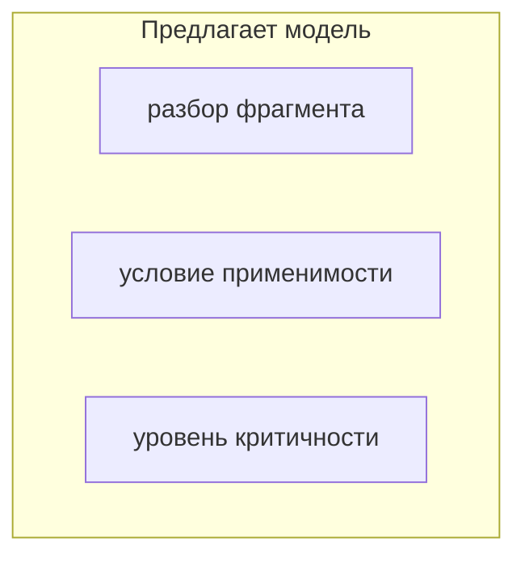

# Skill: схемы mermaid — сверху вниз

## Когда применять

Всегда, когда схема рисуется в mermaid внутри документа, который читают **в браузере
или на ноутбуке**: README на GitHub, пояснительная записка комплекта ЕСПД, разбор темы,
заметка vault'а.

## Правило

**`flowchart TB`, а не `flowchart LR`.** То же для `stateDiagram-v2`: `direction TB`.

## Почему

Место под схему ограничено **шириной колонки**, а не высотой. GitHub, Obsidian
и предпросмотр редактора вписывают схему в ширину и не дают ей выйти за неё.

* горизонтальная схема растёт **в ограниченную сторону**: когда она перестаёт помещаться,
  движок ужимает её целиком — вместе с текстом в узлах. На ноутбуке подписи становятся
  нечитаемыми, и картинка перестаёт работать;
* вертикальная растёт **в неограниченную сторону**: ширина остаётся в пределах колонки,
  масштаб не уменьшается, текст читается. Прокрутка вниз — обычное для страницы действие,
  прокрутка вбок — нет.

Второй довод: читатель уже идёт по странице сверху вниз. Схема, направленная туда же,
не заставляет его менять направление чтения.

## Ловушка: подграфы делают вертикальную схему горизонтальной

Схема может быть объявлена как `TB` и всё равно расползтись вширь. Причина —
**подграфы с несвязанными узлами**:



Между `M1`, `M2`, `M3` рёбер нет, поэтому движок ставит их **на один ранг** — в строку.
Подграф становится в три раза шире узла, а вся схема — шире колонки. Объявление
`direction TB` внутри подграфа этого не меняет: несвязанные узлы остаются на одном ранге.

**Что делать вместо.** Проверено на пояснительной записке НОРМА-СТРОЙ 22.09.2026:

| Приём | Когда годится |
|---|---|
| **Свернуть группу в один узел**, а перечень внести в него строками через `<br/>` | когда внутри группы нет отдельных рёбер к другим узлам. Даёт три-четыре крупных блока в вертикальной цепочке — самый читаемый вариант |
| **Вертикальный хребет**: цепочка основных шагов сверху вниз, второстепенные узлы подвешены сбоку | конвейер, поток данных, путь величины |
| Невидимые связи `A ~~~ B ~~~ C` внутри подграфа | когда группировка рамкой действительно нужна; работает с mermaid 9.4+ |

Отказ от подграфов теряет подписи рамок. Возвращается это **строкой-легендой под схемой**:
«зелёное — люди, голубое — наши части, сиреневое — хранилища, розовое — единственное
ненадёжное место». Легенда текстом ещё и доступна тому, кто читает документ без отрисовки.

## Вторая ловушка: петли в диаграмме состояний накладывают подписи

**[замер 2026-09-22, отрисовка на GitHub]** Диаграмма жизненного цикла карточки
(НОРМА-СТРОЙ, записка, п. 4.4) с двумя петлями `draft --> draft` и `verified --> verified`
вышла с наложенными подписями: текст петли лёг поверх подписи соседнего ребра, а вторая
подпись уехала под соседний блок. Причина — подпись петли кладётся вплотную к узлу,
и место рядом с узлом уже занято подписями входящих и исходящих рёбер.

**Правило:** переход, **не меняющий состояния**, на диаграмме состояний не рисуется.
Это не только про раскладку, это по существу: диаграмма состояний показывает **смену
состояния**, а петля — не смена. Такие переходы выносятся строкой текста под схемой:
«двух переходов на схеме нет намеренно, хотя они происходят, — оба не меняют состояния».

Заодно снимается и вторая беда той же схемы: **длинное описание состояния**
(`verified: Проверена — имя эксперта и время обязательны`) раздувает блок и выталкивает
подписи рёбер на соседей. Имя состояния — одно-два слова; расшифровка — таблицей
под схемой. Таблица к тому же читается без отрисовки.

## Чего этот приём не решает

* **`erDiagram`** направления не имеет: раскладку выбирает движок, повлиять на неё нельзя.
  Если схема данных расползлась — сокращать число сущностей, а не искать настройку;
* очень длинная цепочка (пятнадцать и более узлов подряд) читается крупно, но требует
  прокрутки. Это приемлемо; разрезать её на две схемы стоит только тогда, когда у половин
  есть самостоятельный смысл;
* **отрисовку проверить нечем**, если `mermaid-cli` не установлен. Сбалансированность
  кавычек, `subgraph`/`end` и синтаксис проверяются скриптом; то, как это встанет
  на экране, — только глазами в браузере.

## Проверка перед сдачей документа

```bash
grep -n "flowchart LR\|graph LR\|direction LR" docs/*.md
```

Пусто — правило соблюдено. Каждая находка требует довода, почему здесь горизонталь
уместна; довод «так нарисовалось» не считается.

## Связанное

* [ski-coding](ski-coding.md) — схема живёт в исходном тексте документа, а не приходит
  картинкой из постороннего редактора: картинка устаревает молча.
* Навык `gost-19-dokumenty` пакета NSU-AI-SKILLS — требование к схемам в пояснительной
  записке.
* Пример применения: `~/NORMA-STROY/docs/00000-00001-01 81 Пояснительная записка.md`,
  раздел 4 — шесть схем, все вертикальные.
