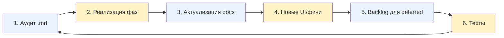

# Ski-coding — методология соло-разработки с LLM

> **Паттерн:** чередование текстовых (`.md`) и кодовых (`commit`) шагов
> — как лыжных следов: левая-правая-левая-правая. Каждый шаг оставляет
> проверяемый артефакт, который можно сверить с предыдущим.

**Автор:** Олег Барбашин (banksnab@gmail.com).
**Дата фиксации:** 2026-05-23.
**Каноничный документ:** [~/RAGRAF/docs/SKILL-SKICODING.md](../../projects/active/ragraf/README.md) — там полная версия с code-patterns, security-checklist, test-discipline (675 строк).
**Здесь:** обобщённая методология для переноса в другие проекты.

---

## 1. Зачем

Классический QA-регламент рассчитан на команду: **PM пишет спек → программист пишет код → QA пишет тест-кейсы → отдельная роль ведёт CI/CD**. У соло-разработчика с LLM такого штата нет, но **процессы должны быть те же** — иначе одна из двух ловушек:

| Ловушка | Что происходит |
|---------|----------------|
| **Code-rush** | Модель пишет код → разработчик мерджит → через неделю 5 несовместимых архитектур, никто не помнит почему |
| **Doc-paralysis** | Модель пишет 4000 строк md → код не меняется → через неделю md устаревают и тонут в `docs/draft_*` |

Ski-coding — **компромисс**: каждый текстовый шаг заканчивается списком конкретных правок; каждый кодовый шаг — актуализацией md. Если шаги пропустить — следы теряются.

Главный эффект: **работа с моделью становится проверяемой**. Каждый артефакт сверяется с предыдущим — код vs аудит, новый ARCHITECTURE.md vs старый ARC.md, тесты vs регрессия.

---

## 2. Цикл из 6 шагов



Синие (1, 3, 5) — **текст**. Жёлтые (2, 4, 6) — **код**. Стрелка от 6 к 1 — это «пересборка карты перед следующим спуском», не «закрытие итерации».

### Шаг 1 (текст) — Аналитический отчёт `<TOPIC>-AUDIT.md`

- TL;DR на 5-7 пунктов: что нашли / что закроем / что отложим.
- Mermaid-диаграммы карты потока данных.
- Таблица «разрыв → P0/P1/P2 → фаза-закрытия».
- Метрика «до» (baseline).
- Раздел §«Что НЕ делаем сейчас» с обоснованием.

**Правило:** аудит — ДО любых правок кода.

### Шаг 2 (код) — Реализация фаз

Коммиты с тегами `Phase A.1`, `Phase A.2`, ..., `Phase F.2`. Каждая фаза:
- Закрывает один пункт из таблицы аудита.
- Самодостаточна — приложение работает после неё.
- Mini-changelog в commit message.

### Шаг 3 (текст) — Актуализация документации

Обновлённые `ARCHITECTURE.md`, `README.md`, `TZ_*.md`, `SKILL-*.md`. Синхронизация с кодом в том же чек-поинте, что и фаза реализации. Правка кода без обновления docs = **долг**, попадает в backlog с P1.

### Шаг 4 (код) — Новые UI-фичи

Компоненты на основе обновлённой документации. Не предложены в шаге 1, **появляются как естественное продолжение шага 3**.

### Шаг 5 (текст) — Backlog для deferred

Каждая отложенная фаза получает запись:

```markdown
### Phase X — что-то
- **Откладывается до:** конкретное условие
- **Почему:** ОДНА фраза с причиной
- **Когда возвращаемся:** триггер
- **Оценка:** N сессий
```

**Правило:** «отложено без `Почему`» = недопроанализированная фаза, идёт обратно в шаг 1.

### Шаг 6 (код) — Тесты

Каждой фазе соответствует свой smoke-тест `test_<phase>.py`. Если фаза не покрыта — следующий шаг 1 начинается с пункта «нет регресс-щита».

---

## 3. Save-Then-Rewrite для больших документов

Когда документ устарел на 60%+, **не правим in-place**:

1. `git mv docs/ARC.md docs/draft_arc.md` — сохраняем оригинал как черновик.
2. Пишем новый `docs/ARCHITECTURE.md` с нуля по актуальному коду.
3. В новом — ссылка `> Старая версия: [draft_arc.md](draft_arc.md)`.
4. Через 2-3 итерации удаляем `draft_arc.md` отдельным коммитом.

**Зачем:** in-place правка большого md = непредсказуемые диффы, теряется история «как мы думали раньше».

**Когда НЕ применять:** правка 1-2 абзацев / документ <100 строк.

---

## 4. Phase-decomposition

### Гранулярность

`A.1 / A.2 / A.3 → B → C.1 / C.2`. Уровень — семантическая группа («Phase A — закрытие P0»), подуровень — отдельный коммит/PR.

### Критерий «фаза готова»

- Backend smoke-import зелёный (`python -c "import app.main"`).
- Frontend type-check зелёный (`npx tsc --noEmit`).
- Минимум один тест в `backend/tests/`.
- Документация обновлена.
- В аудит-документе пункт помечен `[x] закрыто, см. <commit>`.

### Когда фазу откладывать

- Требует внешних данных (фикстур, LLM-ключа, реального сенсора).
- Меняет UX-флоу настолько, что нужна итерация с заказчиком.
- Cost > benefit.
- Зависит от непросчитанной фазы.

### Когда фазу **не** откладывать

- Закрывает P0 (логическая дыра).
- Регрессия от работавшей версии.
- Безопасность.

---

## 5. Verification-Before-Recommendation

Память LLM (`~/.claude/.../memory/`) — **не источник истины**. Устаревает за 1-2 итерации. Правило:

> Перед рекомендацией «используй файл X» или «у нас уже есть функция Y» — открыть X через Read или подтвердить grep'ом.

**Признаки устаревшей памяти:**
- Упоминание файла, которого нет в `git ls-files`.
- Ссылка на функцию с другой сигнатурой.
- «В проекте мы используем X», когда X удалён 3 коммита назад.

---

## 6. Self-Aware Reporting

После реализации фазы — **возвращаемся в аудит-документ** и проставляем статус:

```markdown
### Разрыв P0-2 — нет acceptance_resolver
- **Было:** verdict уходил, обратной связи не было.
- **Стало (Phase A.1):** acceptance_resolver пишет criterion_passed через TTL.
- **Закрыто:** commit cf94fc4, тест test_acceptance_resolver_e2e.
```

Это превращает аудит из «снимка момента» в **живой документ прогресса**. Через 6 итераций открываешь AUDIT.md и видишь всю историю.

---

## 7. Anti-patterns

| Анти-паттерн | Как правильно |
|--------------|---------------|
| Прыгнуть в код без аудит-md | Шаг 1 — аудит |
| Писать 4000 строк md без кода | Шаг 2 — реализация |
| In-place правка большого ARC.md | Save-Then-Rewrite |
| `git add .` | Конкретные файлы |
| `--no-verify` для обхода hook | Чиним причину |
| Откладывать «потому что сложно» | `Почему` обязательно |
| Тест-после-релиза | Шаг 6 в цикле |
| Доверять памяти без проверки | §5 |
| Один большой коммит «сделал всё» | Phase-decomposition |
| Hard reject на legacy-данных | Soft validation (warning, не блок) |

---

## 8. Метрики качества цикла (ретроспектива каждые 5-7 итераций)

- [ ] Аудит-документы актуальны (нет «закрытых» пунктов без ссылки на commit/test)?
- [ ] BACKLOG.md содержит `Почему` для каждой deferred-фазы?
- [ ] Тесты покрывают все фазы, дошедшие до main?
- [ ] Type-check / smoke-import зелёные?
- [ ] Нет `draft_*.md` старше 3 итераций?
- [ ] Methodology page обновлён (full/partial/planned)?
- [ ] `.gitignore` закрывает секреты (`.env`, `.duckdb`, `credentials.json`)?

Если 2+ галки не проставлены — следующая итерация начинается **с ретроспективы**, не с новой фичи.

---

## 9. Промпты-обёртки итерации

### Стартовый

> «Открой [docs/<последний>-AUDIT.md] и [BACKLOG.md]. Скажи, какая фаза следующая по приоритету и почему. Не пиши код, пока не подтвердим план.»

### Завершающий

> «Обнови [docs/<последний>-AUDIT.md] разделом ‘Закрыто в этой итерации’ и проставь статус ‘full/partial/planned’ в methodology. Не создавай новый md.»

---

## 10. Применимость к другим проектам

| Проект | Применимо | Почему |
|--------|-----------|--------|
| **RAGRAF** | ✅ Эталон | Здесь паттерн родился и зафиксирован |
| **LEYKA** | ✅ Полностью | Соло-разработка, та же связка FastAPI + React |
| **NSK_OpenData_Bot** | ✅ Полностью | Соло, Python, чёткие фазы ETL |
| **AI-SKLAD** | ✅ После роста до пилота | Сейчас демо, ski-coding избыточен |
| **POLINOM, POLINOM-JAVA** | ⚠️ Частично | Научный, фазы соответствуют экспериментам, не sprint'ам |
| **SOFIA, GONKA, KNIFFEL** | ⚠️ Сокращённо | Pet, шаги 1+2+6 достаточно (без 3-4-5) |
| **SIGMA-стиль командные проекты** | ❌ | Командный код-ревью, не одиночная разработка |

---

## 11. Связь с классическим QA-циклом

Ski-coding — это **компактификация** классических 5 стадий QA в один цикл из 6 шагов, выполнимый одним разработчиком:

| Классические 5 стадий QA | Соответствие в ski-coding |
|---------------------------|----------------------------|
| 1. Идея (Vision, MRD) | Шаг 1: аудит — первый аудит для нового модуля = vision |
| 2. Дизайн+документация (PRD, тест-план) | Шаги 1+3: аудит + актуализация ARCHITECTURE/SKILL |
| 3. Кодирование (юнит-тесты) | Шаги 2+4: фазы реализации + новые UI-фичи |
| 4. Тестирование (баг-репорты) | Шаг 6: phase-tests + smoke-import + tsc |
| 5. Релиз+метрики | Самооценка §8 + Self-Aware Reporting (§6) |

См. плейбук [13-quality-management](../../docs/playbooks/13-quality-management.md) — полное наложение.

---

## 12. Связанное

- **Полная версия с code-patterns** (DuckDB tz, best-effort sync, security checklist): [~/RAGRAF/docs/SKILL-SKICODING.md](../../projects/active/ragraf/README.md)
- **Плейбук квалитета:** [13-quality-management](../../docs/playbooks/13-quality-management.md) — как ski-coding ложится на классический QA-цикл
- **Концепты:** [test-pyramid](../../concepts/test-pyramid.md), [bug-tracking](../../concepts/bug-tracking.md), [test-design-techniques](../../concepts/test-design-techniques.md), [ci-cd](../../concepts/ci-cd.md)
- **Skill-предшественник:** [discovery-interview](discovery-interview.md) — применяется ДО начала ski-coding-итераций
- **Плейбук стадии 6:** [06-skill-series](../../docs/playbooks/06-skill-series.md) — стиль SKILL-NN-*.md документов, в которых живёт ski-coding
